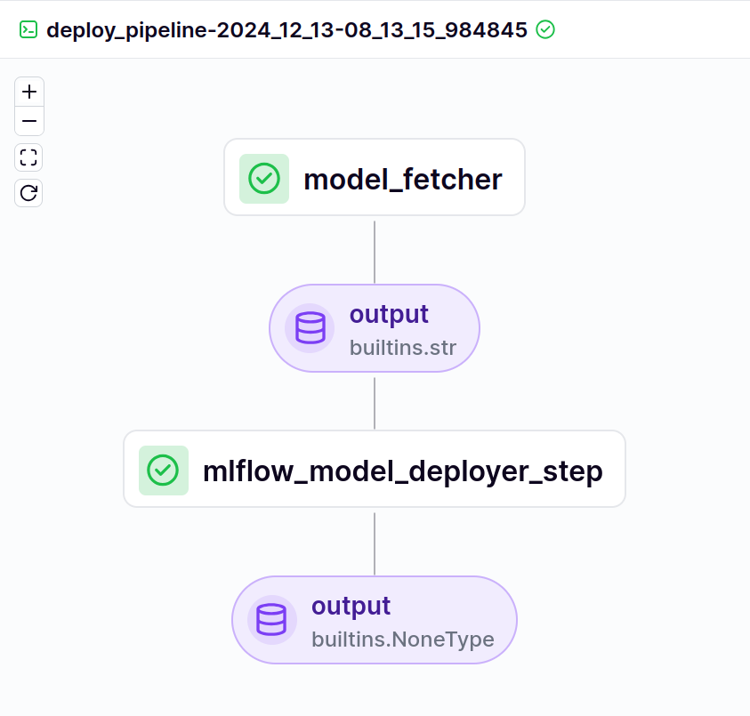

# Customer Lifetime Value Prediction MLOps Project

## Overview
This project implements a robust machine learning pipeline for predicting **Customer Lifetime Value (CLTV)** using ZenML. The goal is to estimate the long-term value of customers during their journey with the organization. The pipeline employs an **XGBoost Regressor** model, leveraging Online Retail dataset from the [UCI Machine Learning Repository](https://archive.ics.uci.edu/dataset/352/online+retail). Key features of the project include:

- **Exploratory Data Analysis (EDA):** Conducted detailed EDA (available in the `data_analysis` folder), including feature selection and handling missing values.
- **Pipeline Automation:** Designed a ZenML pipeline with modular steps for training and deployment.
- **Experiment Tracking and Deployment:** Integrated **MLflow** for seamless experiment tracking and model deployment.
- **User Interface:** Developed a Flask application for interactive CLTV predictions.


---
## *For Non-Developers*

If you are not interested in the code and just want to use the model, Kindly click on the below link to use the model which is deployed on a Free-tier Render Server(It might work slow depending on the traffic)

[Predict CLTV](https://customer-lifetime-value-prediction-mlops.onrender.com)


## Prerequisites

To get started, ensure you have the following installed:

- **Python 3.10**
- **ZenML**
- **MLflow**
- **Flask**
---

## Repository Structure

Here is a brief overview of the repository's contents:

- **`.vscode/`**: Contains workspace configurations.
- **`.zen/`**: ZenML configuration and metadata.
- **`data/`**: Includes raw data files.
- **`data_analysis/`**: Scripts and notebooks for exploratory data analysis.
- **`img/`**: Visual assets for the README or other documentation.
- **`materializer/`**: Custom materializers for ZenML pipelines.
- **`models/`**: Saved models for deployment.
- **`pipelines/`**: Pipeline definitions for ZenML.
- **`src/`**: Core source code.
- **`steps/`**: Modular ZenML steps for the pipeline.
- **`templates/`**: HTML templates for the Flask app.
- **`app.py`**: Flask application for user interaction.
- **`mlflow.db`**: MLflow database for tracking experiments.
- **`requirements.txt`**: Python dependencies.
- **`run_deployment.py`**: Script to trigger deployment pipelines.
- **`run_pipeline.py`**: Script to trigger training pipelines.

---

## Setup Instructions

### Clone the Repository

Clone this repository using the following command:

```bash
git clone https://github.com/Kabyik-Kayal/Customer-Lifetime-Value-Prediction-MLOps.git
```

### Environment Configuration

1. **Set up and activate your Python environment:**

    ```bash
    python3.10 -m venv myenv
    source myenv/bin/activate
    ```

2. **Install dependencies:**

    ```bash
    pip install -r requirements.txt
    pip install zenml["server"]
    ```

---

## ZenML Dashboard

To monitor pipelines and manage model-building steps, launch the ZenML dashboard:

```bash
zenml up
```

Log in with the default user credentials (no password required) and proceed to the next steps.

---

## ZenML Stack Setup

This project uses a local stack with the following components:

- **Local orchestrator**
- **Local artifact store**
- **MLflow experiment tracker**
- **MLflow model deployer**

Register and configure the stack using these commands:

```bash
zenml orchestrator register local_orchestrator --flavor=local
zenml artifact-store register local_artifact_store --flavor=local
zenml experiment-tracker register mlflow_tracker --flavor=mlflow
zenml model-deployer register mlflow_deployer --flavor=mlflow

zenml stack register local_stack \
    -o local_orchestrator \
    -a local_artifact_store \
    -e mlflow_tracker \
    -d mlflow_deployer

zenml stack set local_stack
```

Verify the setup:

```bash
zenml stack list
```

---

## Model Building Pipeline

The training pipeline in this project follows a structured, modular approach. Below are the detailed steps:

1. **Data Ingestion:**
   - Extract raw data from the source (Online Retail dataset).
   - Load data into a structured format for preprocessing.

2. **Handling Missing Values:**
   - Identify and fill or remove missing entries to ensure data consistency.

3. **Dropping Unnecessary Columns:**
   - Remove features that are not relevant to the CLTV prediction task.

4. **Detecting and Handling Outliers:**
   - Identify anomalous data points using statistical methods.
   - Apply transformations or filtering to mitigate their impact.

5. **Feature Engineering:**
   - Create new features that capture important customer behaviors.
   - Normalize and scale numerical features for model compatibility.

6. **Data Splitting:**
   - Partition the data into training and testing sets for unbiased evaluation.

7. **Data Resampling:**
   - Resamples the data using Bootstrap Resampling method.

8. **Model Training:**
   - Train an XGBoost Regressor model wrapped within a Scikit-Learn pipeline.
   - Utilize numeric preprocessors for optimal model performance.

9. **Model Evaluation:**
   - Assess the model using appropriate metrics like RMSE and R².

To run the training pipeline:

```bash
python run_pipeline.py
```

Once executed, the pipeline steps will be displayed in the ZenML dashboard:


> **Figure 1:** ZenML Training Pipeline Visualization

To monitor the experiment details, start the MLflow dashboard:

```bash
mlflow ui
```


> **Figure 2:** MLflow Experiment Tracking Dashboard

---

## Deployment

To deploy the latest trained model using the MLflow model deployer, run the deployment pipeline:

```bash
python run_deployment.py
```

This will initiate the deployment pipeline, as visualized below:



> **Figure 3:** ZenML Deployment Pipeline Visualization

---

## Prediction

The project includes a Flask-based UI for predicting CLTV. Launch the Flask app:

```bash
python app.py
```

Input customer data through the UI to get predictions for their lifetime value.


> **Figure 4:** Flask Application for CLTV Prediction

---

## Key Features

- **End-to-End Automation:** From data preprocessing to model deployment.
- **Experiment Tracking:** Comprehensive tracking of experiments with MLflow.
- **Interactive Predictions:** User-friendly interface for real-time predictions.

---

For any issues or contributions, feel free to open an issue or submit a pull request. Thank you for exploring the **Customer Lifetime Value Prediction MLOps Project**!

This project is licensed under the MIT License.
