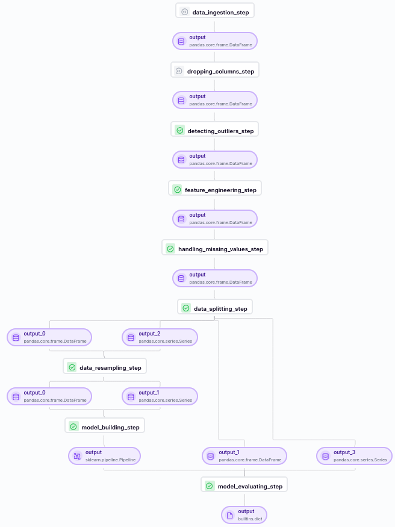

# Customer Lifetime Value Prediction MLOps Project

## Overview
This project implements a machine learning pipeline for customer lifetime prediction using ZenML. It focuses on predicting the lifetime value throughout their journey with the organization by the help of an XGBoost Regressor model. The dataset (Online_Retail.xlsx) is taken from the UCI Machine Learning Repository for this project.
We have performed some EDA on the dataset which is available in the data_analysis folder, and concluded to drop some features and missing values.
We have implemented zenml steps inside the zenml pipeline for training and deployment. We have actively used Mlflow for experiment tracking and deployment.
Atlast we have used a Flask app to create an UI and predict CLTV of a customer by inputing value.

## Prerequisites
- Python 3.10
- ZenML
- MLflow

## Clone the repository

Kindly clone this repository by using the following bash commands:
``` bash
git clone https://github.com/Kabyik-Kayal/Customer-Lifetime-Value-Prediction-MLOps.git
```

## Setup
Follow the commands in the setup script below to configure your environment.

## set and activate your python environment

```bash
python3.10 -m myenv venv
source venv/bin/activate
```

## Install the requirements 
```bash
pip install -r requirements.txt
pip install zenml["server"]
```
## Run Zenml Dashboard

Use the following command to run the zenml dashboard to keep track of your pipelines and model building steps :

```bash
zenml up
```
After using the above command a zenml dashboard will open, login with the default user and without any password and follow the next steps.

## Zenml stack setup
The project uses a local stack configuration with the following components:
- Local orchestrator
- Local artifact store
- MLflow experiment tracker
- MLflow model deployer

Register zenml components and set the stack by using the following commands:

```bash

zenml orchestrator register local_orchestrator --flavor=local
zenml artifact-store register local_artifact_store --flavor=local
zenml experiment-tracker register mlflow_tracker --flavor=mlflow
zenml model-deployer register mlflow_deployer --flavor=mlflow

zenml stack register local_stack \
    -o local_orchestrator \
    -a local_artifact_store \
    -e mlflow_tracker \
    -d mlflow_deployer

zenml stack set local_stack
```
To check if the stack is successfully set run this command:
```bash
zenml stack list
```
## Model Building

We have used zenml steps to organise the model building steps in a zenml pipeline which can be viewed in the zenml dashboard as the diagram below shows.

But before that we have to run the following command to start the model training pipeline:

```bash
python run_pipeline.py
```
As we run the python command we can see the model building process has started and different steps of the pipeline are being executed one after another from ingesting the data to feature engineering to spliting the data and then finally training the XGboost Regressor Model wrapped within a Scikit-Learn Pipeline along with numeric preprocessors. 


*Figure 1: ZenML Training Pipeline Visualization*

Now we can run our MLFlow Dashboard to check the trained model.


*Figure 2: MLflow Experiment Tracking Dashboard*

## Deployment

Run the run_deployment.py file to deploy the latest model using MLflow model deployer step from zenml.

```bash
python run_deployment.py
```


*Figure 2: Zenml Deployment Pipeline Visualization*

## Prediction

Using Flask we have build a UI to input data and Predict CLTV Value of a customer.
Run the app.py to open the website.

```bash
python app.py
```
